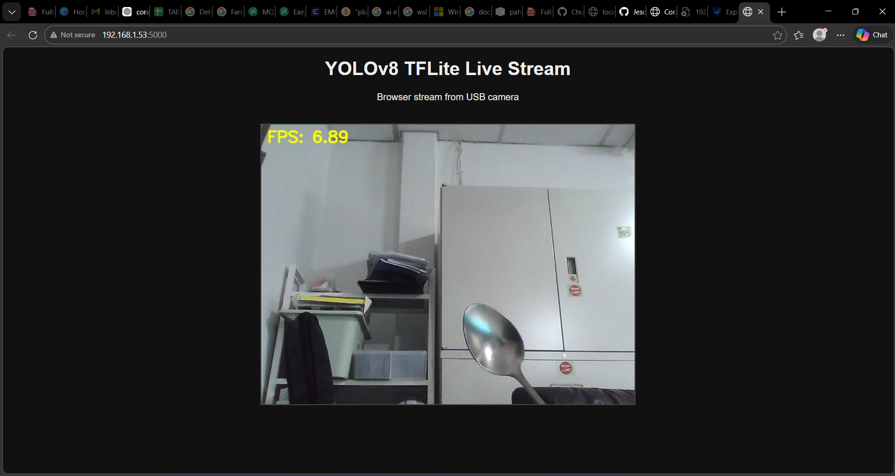
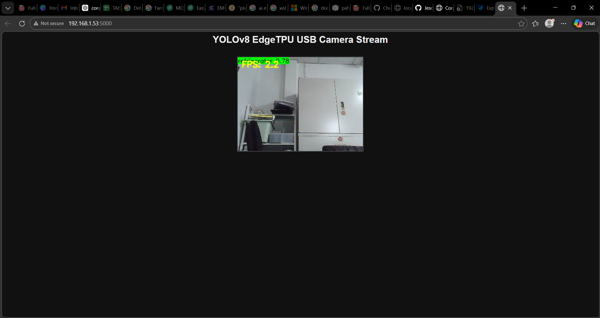
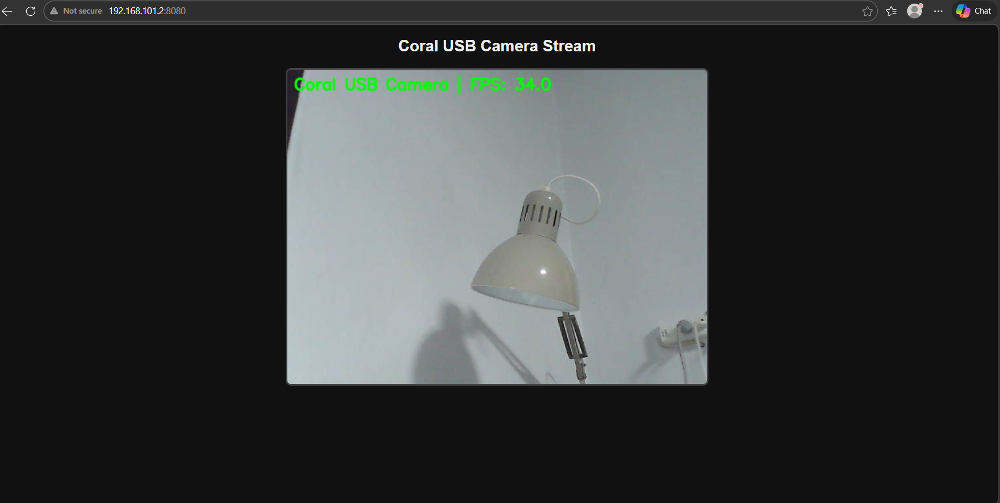
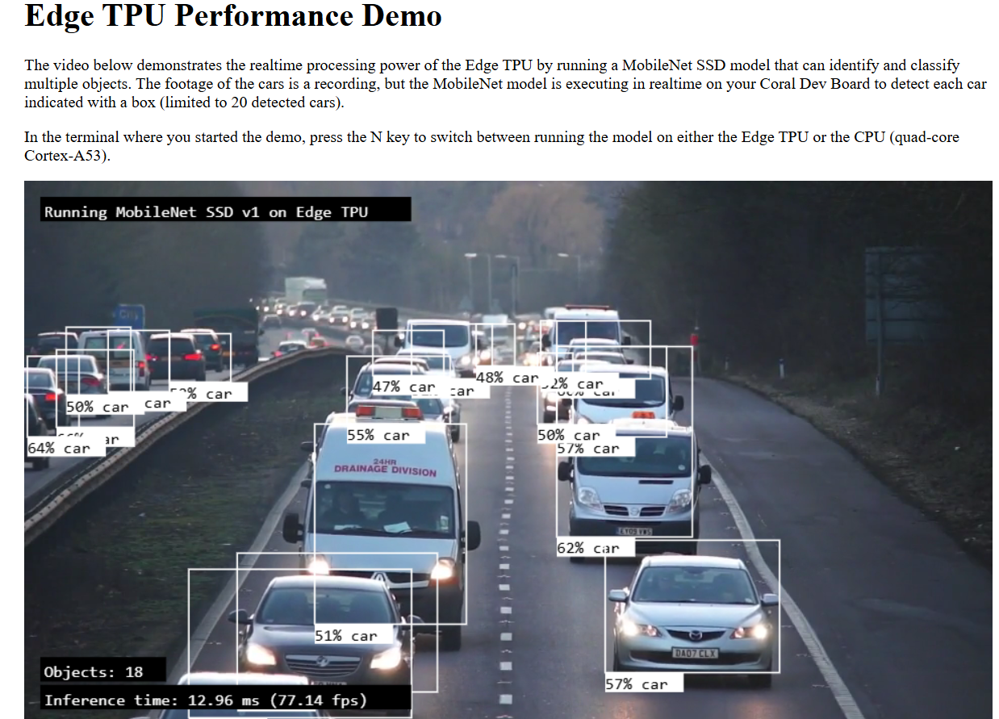

# ICT740-project

# milestone

1.board			          :white_check_mark:

2.USB camera          :white_check_mark:

3.model               

4.area detection      

5.send notification    

#current works

yolo_tflite_browser_v1.py

yolo_tflite_browser_v2.py

yolo_tflite_browser_v3_fixed.py

usb_cam_browser.py

from running an example

